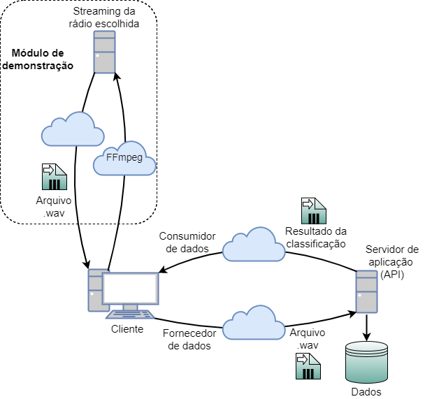
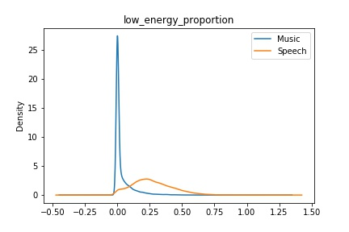
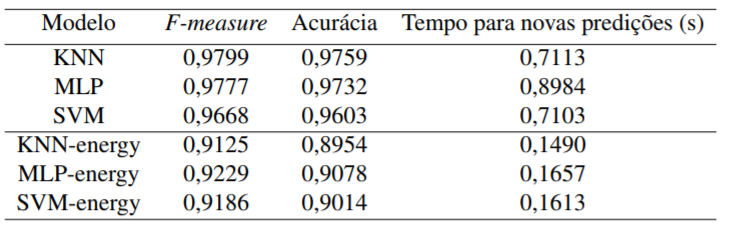

## PROPOSTA

Este projeto consiste em um sistema para distinção de áudios entre fala e música, voltado inicialmente para as necessidades de uma startup que monitora milhares de rádios e acompanha as músicas tocadas em cada uma delas, gerando relatórios e recomendações para profissionais do ramo da música. O processo atual de identificação de cada música tocada é computacionalmente custoso, de forma que tempo e dinheiro são gastos desnecessariamente quando se tenta reconhecer uma amostra que não seja de fato música. Nesse contexto, este projeto pode ser utilizado pela empresa como um pré-processamento dos áudios gravados. Alternativamente, seria possível utilizar o sistema como um pós-processamento dos áudios não reconhecidos pela empresa, para verificar se existem músicas não identificadas no processo atual, o que permitiria aumentar sua confiabilidade dos dados.

## ESPECIFICAÇÃO DA ARQUITETURA
A especificação da arquitetura do projeto foi feita com base no RM-ODP (Reference Model of Open Distributed Processing), que utiliza 5 visões (empresa, informação, computação, engenharia e tecnologia). Estas visões tratam de aspectos diferentes do projeto e permitem criar uma MVA (Minimal Viable Architecture) a partir dos requisitos do negócio. A Figura abaixo mostra a visão da engenharia, relacionada à distribuição e infraestrutura do sistema

  

## IMPLEMENTAÇÃO E RESULTADOS

A implementação do projeto foi feita em três etapas:

### 1. Estruturação e exploração do dataset
Foram gravadas 16 rádios brasileiras através de seus serviços de streaming com o programa FFmpeg, totalizando 11,8 horas de áudio, sendo 59,5% de música e 40,5% de fala. Então, a ferramenta YAAFE (Yet Another Audio Feature Extractor) foi utilizada para extrair características do áudio, transformando as informações acústicas em informações numéricas. A figura abaixo mostra a distribuição das classes música e fala para um dos atributos do áudio mais úteis na classificação.

  

### 2. Construção e validação dos modelos de classificação
Três classificadores (KNN, MLP e SVM) foram implementados e avaliados. Em todos os modelos, utilizou-se um algoritmo de ordenação dos atributos dos dados por relevância. Assim, dos 49 atributos do áudio disponíveis, aproximadamente 15 foram de fato úteis, variando conforme o classificador. Ainda, para reduzir o tempo de novas predições outros classificadores foram construídos, utilizando apenas a informação de energia do áudio. A tabela a seguir mostra os resultados alcançados. 

  

### 3. Desenvolvimento da API e do sistema web
Por fim, uma API foi desenvolvida para permitir o acesso externo ao sistema. Um cliente envia um arquivo de áudio e a API retorna sua classificação segundo a segundo, assim como a estimativa de porcentagem de música contida no arquivo. Para demonstração do sistema de forma prática e visual, elaborou-se também um sistema web.

## LINK PARA O SITE DE DEMONSTRAÇÃO
Mais próximo da data da feira de apresentação do TCC (19/12), o link do site de demonstração do projeto será disponibilizado aqui!

## GRUPO
* Felipe Malbergier
* Nazli Setton
* Rodrigo Sabino

##### Orientador: Prof. Jorge Risco

